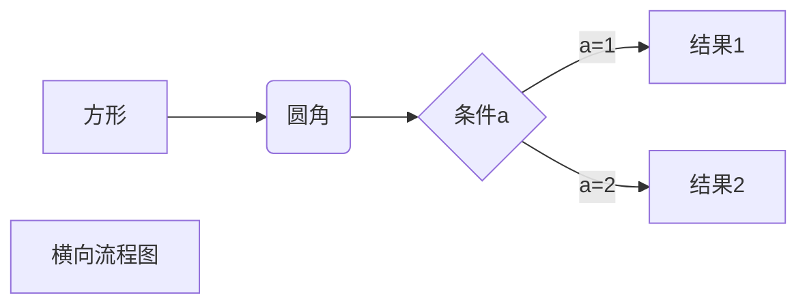
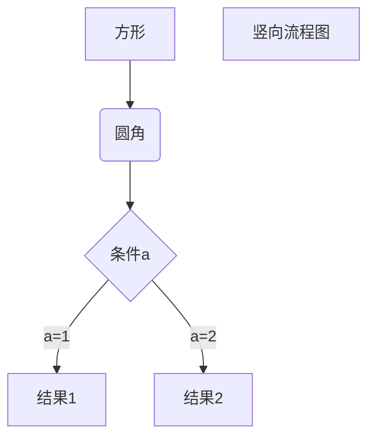
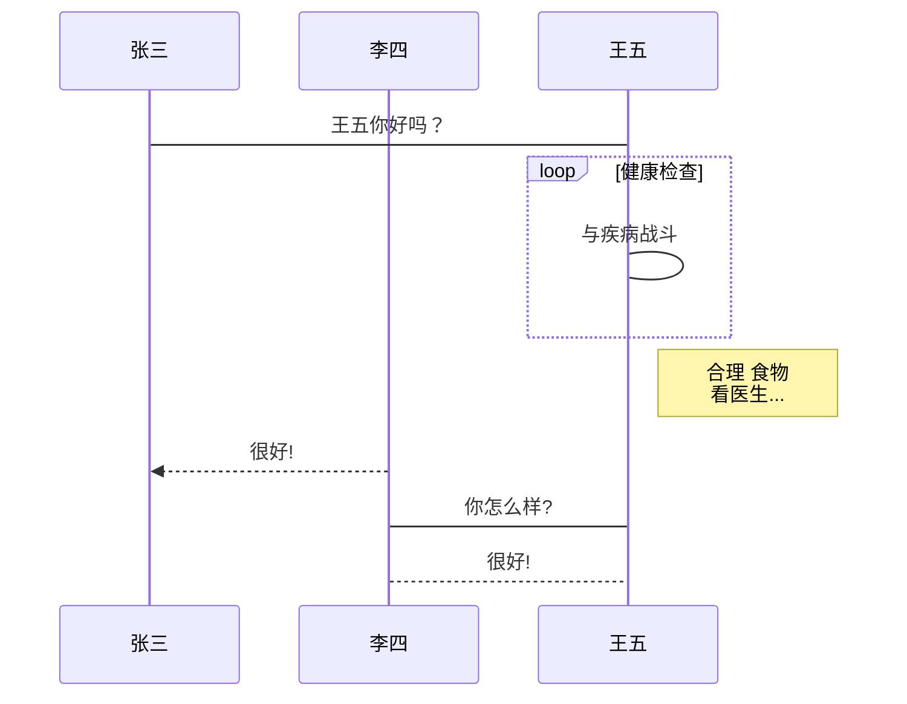
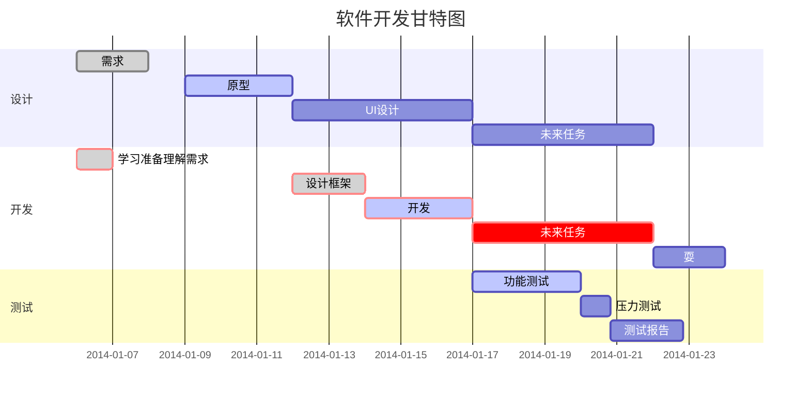

# 基础Markdown语法

### 1.标题

```markdown
# 一级标题

## 二级标题

### 三级标题

#### 四级标题

##### 五级标题
```

# 一级标题

## 二级标题

### 三级标题

#### 四级标题

##### 五级标题


### 2.列表

```markdown
- 无序列表1
- 无序列表2
1. 有序列表1
2. 有序列表2
```

- 无序列表1
- 无序列表2
1. 有序列表1
2. 有序列表2


### 3.引用

```markdown
> 这个是引用
>
> 和电子邮件的引用格式很像
```

> 这个是引用
>
> 和电子邮件的引用格式很像


### 4.粗体和斜体

```markdown
**这个是粗体**

*这个是斜体*

***这个是粗斜体***
```

**这个是粗体**

*这个是斜体*

***这个是粗斜体***


### 5.链接与图片

```markdown
[简书](http://www.jianshu.com)

 [link text][id]

[id]: http://example.com/  "optional title here"

<http://example.com/> or <address@example.com>


```

[简书](http://www.jianshu.com)

 [link text][id]

[id]: http://example.com/  "optional title here"

<http://example.com/> or <address@example.com>


### 6.代码

```markdown
  <php>
       echo “hello world";
  </php>
  Use the `printf()` function.
```

```php
  <php>
       echo “hello world";
  </php>
```

行内引用代码：

Use the `printf()` function.


### 7.分割线

可以在一行中用三个以上的星号、减号、底线来建立一个分隔线

---


### 8.Markdown段落

段落的换行可以是使用两个以上空格加上回车 

也可以是在段落后面使用一个空行来表示重新开始一个段落  


### 9.下划线

```markdown
下划线可以通过HTML的<u>标签来实现：  
<u>带下划线文本</u>
```

<u>带下划线文本</u>


### 10.脚注

脚注是对文本的补充说明。

Markdown脚注的格式如下：

`[^要注明的文本]`

```markdown
创建脚注格式类似这样 [^RUNOOB]。

[^RUNOOB]: 菜鸟教程 -- 学的不仅是技术，更是梦想！！！
```

创建脚注格式类似这样 [^RUNOOB]。

[^RUNOOB]: 菜鸟教程 -- 学的不仅是技术，更是梦想！！！


# 扩展Markdown语法(github扩展语法)

### 1.删除线

```markdown
~~Mistake text.~~
```

~~Mistake text.~~


### 2.代码块与语法高亮

```markdown
```ruby
require 'redcarpet'
markdown=Redcarpet.new("Hello World!")
puts markdown.to_html
```
```ruby

```ruby
require 'redcarpet'
markdown=Redcarpet.new("Hello World!")
puts markdown.to_html
```


### 3.表格

```markdown
| Tables        |      Are      |  Cool |
| ------------- | :-----------: | ----: |
| col 3 is      | right-aligned | $1600 |
| col 2 is      |   centered    |   $12 |
| zebra stripes |   are neat    |    $1 |
```

| Tables        |      Are      |  Cool |
| ------------- | :-----------: | ----: |
| col 3 is      | right-aligned | $1600 |
| col 2 is      |   centered    |   $12 |
| zebra stripes |   are neat    |    $1 |


### 4.任务列表

```markdown
 - [ ] @mentions, #refs, [links](), **formatting**, and <del>tags</del> are supported
 - [x] list syntax is required (any unordered or ordered list supported)
 - [x] this is a complete item
 - [ ] this is an incomplete item
```

 - [ ] @mentions, #refs, [links](), **formatting**, and <del>tags</del> are supported
 - [x] list syntax is required (any unordered or ordered list supported)
 - [x] this is a complete item
 - [ ] this is an incomplete item


# 其他高级用法

### 1.支持的HTML元素

不在Markdown涵盖范围之内的标签，都可以直接在文档里面用HTML撰写。

```markdown
换行：测试<br/>一下
标记：<mark>测试一下</mark>
空格：&nbsp;&nbsp;&nbsp;&nbsp;&nbsp;&nbsp;&nbsp;&nbsp;测试一下
删除线：<s>测试一下</s>
下划线：<u>测试一下</u>
字体增大：<big>测试一下</big>
字体减小：<small>测试一下</small>
文字上标：测试<sup>一下</sup>
文字下标：测试<sub>一下</sub>
右对齐：<p align=right>测试一下</p>
文字居中：<center>测试一下</center>
图片居中：<p align="center"></p>
```

测试<br/>一下

<mark>测试一下</mark>

&nbsp;&nbsp;&nbsp;&nbsp;&nbsp;&nbsp;&nbsp;&nbsp;测试一下

<s>测试一下</s>

<u>测试一下</u>

<big>测试一下</big>

<small>测试一下</small>

测试<sup>一下</sup>

测试<sub>一下</sub>

<p align=right>测试一下</p>

<center>测试一下</center>

<p align="center"></p>


### 2.转义

Markdown 使用了很多特殊符号来表示特定的意义，如果需要显示特定的符号则需要使用转义字符，Markdown 使用反斜杠转义特殊字符。  

Markdown支持<mark>以下这些符号</mark>mark>前面加上反斜杠来版主插上普通的符号:

```markdown
\   反斜线
`   反引号
*   星号
_   下划线
{}  花括号
[]  方括号
()  小括号
#   井字号
+   加号
-   减号
.   英文句点
!   感叹号
```


### 3.公式

待补充


### 4.画流程图/时序图/甘特图

~~~markdown
①横向流程图源码格式：

~~~


~~~markdown
②竖向流程图源码格式：

~~~


~~~markdown
③标准流程图源码格式
```flow
st=>start: 开始框
op=>operation: 处理框
cond=>condition: 判断框(是或否?)
sub1=>subroutine: 子流程
io=>inputoutput: 输入输出框
e=>end: 结束框
st->op->cond
cond(yes)->io->e
cond(no)->sub1(right)->op
```
~~~

```flow
st=>start: 开始框
op=>operation: 处理框
cond=>condition: 判断框(是或否?)
sub1=>subroutine: 子流程
io=>inputoutput: 输入输出框
e=>end: 结束框
st->op->cond
cond(yes)->io->e
cond(no)->sub1(right)->op
```

~~~markdown
④标准流程图源码格式（横向）
```flow
st=>start: 开始框
op=>operation: 处理框
cond=>condition: 判断框(是或否?)
sub1=>subroutine: 子流程
io=>inputoutput: 输入输出框
e=>end: 结束框
st(right)->op(right)->cond
cond(yes)->io(bottom)->e
cond(no)->sub1(right)->op
```
~~~

```flow
st=>start: 开始框
op=>operation: 处理框
cond=>condition: 判断框(是或否?)
sub1=>subroutine: 子流程
io=>inputoutput: 输入输出框
e=>end: 结束框
st(right)->op(right)->cond
cond(yes)->io(bottom)->e
cond(no)->sub1(right)->op
```

~~~markdown
⑤UML时序图源码样例：
```sequence
对象A->对象B: 对象B你好吗?（请求）
Note right of 对象B: 对象B的描述
Note left of 对象A: 对象A的描述(提示)
对象B-->对象A: 我很好(响应)
对象A->对象B: 你真的好吗？
```
~~~

```sequence
对象A->对象B: 对象B你好吗?（请求）
Note right of 对象B: 对象B的描述
Note left of 对象A: 对象A的描述(提示)
对象B-->对象A: 我很好(响应)
对象A->对象B: 你真的好吗？
```

~~~markdown
⑥UML时序图源码复杂样例：
```sequence
Title: 标题：复杂使用
对象A->对象B: 对象B你好吗?（请求）
Note right of 对象B: 对象B的描述
Note left of 对象A: 对象A的描述(提示)
对象B-->对象A: 我很好(响应)
对象B->小三: 你好吗
小三-->>对象A: 对象B找我了
对象A->对象B: 你真的好吗？
Note over 小三,对象B: 我们是朋友
participant C
Note right of C: 没人陪我玩
```
~~~

```sequence
Title: 标题：复杂使用
对象A->对象B: 对象B你好吗?（请求）
Note right of 对象B: 对象B的描述
Note left of 对象A: 对象A的描述(提示)
对象B-->对象A: 我很好(响应)
对象B->小三: 你好吗
小三-->>对象A: 对象B找我了
对象A->对象B: 你真的好吗？
Note over 小三,对象B: 我们是朋友
participant C
Note right of C: 没人陪我玩
```

~~~markdown
⑦UML标准时序图样例

~~~


~~~markdown
⑧甘特图样例：

~~~


